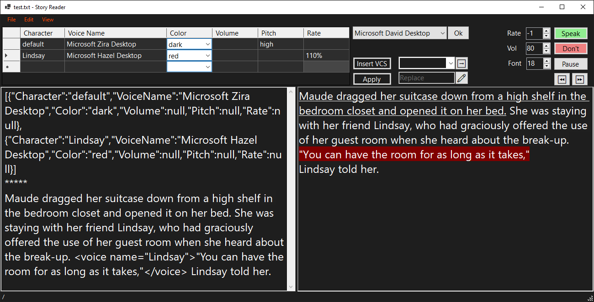

# Story Reader
Text/story is read by selected voices installed on Windows

## TODO
- [x] Add a screenshot to README.md
- [ ] Text search should always start from current position (cursor)
- [ ] Button/Menu item: remove duplicate letters in selection
- [ ] Add volume and rate to Voices table (DGV). Maybe switch to DS as a datasource.
- [ ] Save/Load options (in DataSet?)
- [ ] Speaker shouldn't read header part (before *****)

